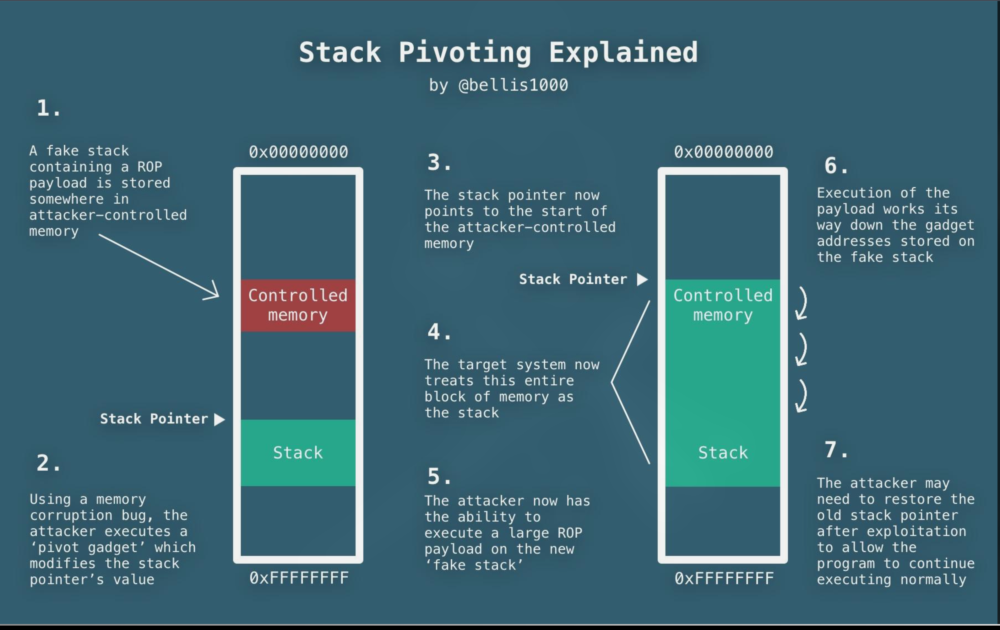

Hello Readers, This page is about understanding of stack pivot for ROP , where the input size is limited after controling RIP.

Then It can be usually done by `leave; ret` gadget as it usually available in most of the binary.
There are other gadgets that we can use such as

```asm
mov rsp, [reg]

pop rsp ; ret

xchg [reg] , rsp 
```
So basically how it is done?  [lets look into GDB :)]	

```asm wrap=false showLineNumbers=false
pwndbg> ni
0x00000000004013fe in vuln ()
LEGEND: STACK | HEAP | CODE | DATA | WX | RODATA
──────────────────────────────────────────────────────────────[ REGISTERS / show-flags off / show-compact-regs off ]──────────────────────────────────────────────────────────────
 RAX  2
 RBX  0
 RCX  0x7ffff7dfc25c (fclose+172) ◂— add rsp, 0x10
 RDX  2
 RDI  0
 RSI  0x7fffffffd4f0 —▸ 0x7fffffff0a61 ◂— 0
 R8   0
 R9   0
 R10  0
 R11  0x202
 R12  0x7fffffffd668 —▸ 0x7fffffffdabd ◂— '/home/hyder/CTF_FILES/h7ctf/pwn/Seccomp/chal'
 R13  1
 R14  0x7ffff7ffd000 (_rtld_global) —▸ 0x7ffff7ffe310 ◂— 0
 R15  0
 RBP  0x7fffffffd530 —▸ 0x7fffffffd540 —▸ 0x7fffffffd5e0 —▸ 0x7fffffffd640 ◂— 0
 RSP  0x7fffffffd460 ◂— 0x218c032900000002
*RIP  0x4013fe (vuln+192) ◂— leave 
───────────────────────────────────────────────────────────────────────[ DISASM / x86-64 / set emulate on ]───────────────────────────────────────────────────────────────────────
b+ 0x4013fd       <vuln+191>    nop    
 ► 0x4013fe       <vuln+192>    leave  
   0x4013ff       <vuln+193>    ret                                <main+58>
    ↓
   0x40143a       <main+58>     mov    eax, 0     EAX => 0
   0x40143f       <main+63>     pop    rbp        RBP => 0x7fffffffd5e0
   0x401440       <main+64>     ret                                <0x7ffff7da46b5>
    ↓
   0x7ffff7da46b5               mov    edi, eax     EDI => 0
   0x7ffff7da46b7               call   exit                        <exit>
 
   0x7ffff7da46bc               call   0x7ffff7e0fbe0              <0x7ffff7e0fbe0>
 
   0x7ffff7da46c1               lock sub dword ptr [rip + 0x1bea07], 1
   0x7ffff7da46c9               je     0x7ffff7da46db              <0x7ffff7da46db>
────────────────────────────────────────────────────────────────────────────────────[ STACK ]─────────────────────────────────────────────────────────────────────────────────────
00:0000│ rsp 0x7fffffffd460 ◂— 0x218c032900000002
01:0008│-0c8 0x7fffffffd468 —▸ 0x4052a0 ◂— 0x405
02:0010│-0c0 0x7fffffffd470 ◂— 0x2073692073696874 ('this is ')
03:0018│-0b8 0x7fffffffd478 ◂— 0xa0a67616c662061 ('a flag\n\n')
04:0020│-0b0 0x7fffffffd480 ◂— 0xffffffffffffffff
05:0028│-0a8 0x7fffffffd488 —▸ 0x7ffff7f645c0 (_IO_2_1_stdout_) ◂— 0xfbad2887
06:0030│-0a0 0x7fffffffd490 —▸ 0x7fffffffd4d0 —▸ 0x7fffffffd4f0 —▸ 0x7fffffff0a61 ◂— 0
07:0038│-098 0x7fffffffd498 —▸ 0x7ffff7e0c4b1 ◂— cmp eax, -1
──────────────────────────────────────────────────────────────────────────────────[ BACKTRACE ]───────────────────────────────────────────────────────────────────────────────────
 ► 0         0x4013fe vuln+192
   1         0x40143a main+58
   2   0x7ffff7da46b5 None
   3   0x7ffff7da4769 __libc_start_main+137
   4         0x4011de _start+46
──────────────────────────────────────────────────────────────────────────────────────────────────────────────────────────────────────────────────────────────────────────────────
pwndbg> x/2gx 0x7fffffffd530
0x7fffffffd530:	0x00007fffffffd540	0x000000000040143a
```
This is before executing the leave instrction , we can see rbp currently points to saved rbp=0x00007fffffffd540 then followed by the saved rip=0x000000000040143a.

So basically what this leave instructon does:
```asm
mov rsp, rbp    ; RSP := RBP
pop rbp         ; RBP := [RSP]; RSP += 8
```

What looks like after `leave` is executed:
```asm wrap=false showLineNumbers=false
0x00000000004013ff in vuln ()
LEGEND: STACK | HEAP | CODE | DATA | WX | RODATA
──────────────────────────────────────────────────────────────[ REGISTERS / show-flags off / show-compact-regs off ]──────────────────────────────────────────────────────────────
 RAX  2
 RBX  0
 RCX  0x7ffff7dfc25c (fclose+172) ◂— add rsp, 0x10
 RDX  2
 RDI  0
 RSI  0x7fffffffd4f0 —▸ 0x7fffffff0a61 ◂— 0
 R8   0
 R9   0
 R10  0
 R11  0x202
 R12  0x7fffffffd668 —▸ 0x7fffffffdabd ◂— '/home/hyder/CTF_FILES/h7ctf/pwn/Seccomp/chal'
 R13  1
 R14  0x7ffff7ffd000 (_rtld_global) —▸ 0x7ffff7ffe310 ◂— 0
 R15  0
*RBP  0x7fffffffd540 —▸ 0x7fffffffd5e0 —▸ 0x7fffffffd640 ◂— 0
*RSP  0x7fffffffd538 —▸ 0x40143a (main+58) ◂— mov eax, 0
*RIP  0x4013ff (vuln+193) ◂— ret 
───────────────────────────────────────────────────────────────────────[ DISASM / x86-64 / set emulate on ]───────────────────────────────────────────────────────────────────────
b+ 0x4013fd       <vuln+191>    nop    
   0x4013fe       <vuln+192>    leave  
 ► 0x4013ff       <vuln+193>    ret                                <main+58>
    ↓
   0x40143a       <main+58>     mov    eax, 0     EAX => 0
   0x40143f       <main+63>     pop    rbp        RBP => 0x7fffffffd5e0
   0x401440       <main+64>     ret                                <0x7ffff7da46b5>
    ↓
   0x7ffff7da46b5               mov    edi, eax     EDI => 0
   0x7ffff7da46b7               call   exit                        <exit>
 
   0x7ffff7da46bc               call   0x7ffff7e0fbe0              <0x7ffff7e0fbe0>
 
   0x7ffff7da46c1               lock sub dword ptr [rip + 0x1bea07], 1
   0x7ffff7da46c9               je     0x7ffff7da46db              <0x7ffff7da46db>
────────────────────────────────────────────────────────────────────────────────────[ STACK ]─────────────────────────────────────────────────────────────────────────────────────
00:0000│ rsp 0x7fffffffd538 —▸ 0x40143a (main+58) ◂— mov eax, 0
01:0008│ rbp 0x7fffffffd540 —▸ 0x7fffffffd5e0 —▸ 0x7fffffffd640 ◂— 0
02:0010│+008 0x7fffffffd548 —▸ 0x7ffff7da46b5 ◂— mov edi, eax
03:0018│+010 0x7fffffffd550 —▸ 0x7ffff7fc6000 ◂— 0x3010102464c457f
04:0020│+018 0x7fffffffd558 —▸ 0x7fffffffd668 —▸ 0x7fffffffdabd ◂— '/home/hyder/CTF_FILES/h7ctf/pwn/Seccomp/chal'
05:0028│+020 0x7fffffffd560 ◂— 0x1ffffd5a0
06:0030│+028 0x7fffffffd568 —▸ 0x401400 (main) ◂— endbr64 
07:0038│+030 0x7fffffffd570 ◂— 0
──────────────────────────────────────────────────────────────────────────────────[ BACKTRACE ]───────────────────────────────────────────────────────────────────────────────────
 ► 0         0x4013ff vuln+193
   1         0x40143a main+58
   2   0x7ffff7da46b5 None
   3   0x7ffff7da4769 __libc_start_main+137
   4         0x4011de _start+46
──────────────────────────────────────────────────────────────────────────────────────────────────────────────────────────────────────────────────────────────────────────────────
pwndbg> 
``` 

Now we can see that rsp points to the address 0x40143a , which the ret [pop rip] executes to return to the caller function.

So goal here is that if we can control rsp , then we control pretty much make the functions reurn to our controled address.

While pivoting usually our target address are heap , bss or other writeable area to store our gadgets and then pivot to that location.

Illustration:
